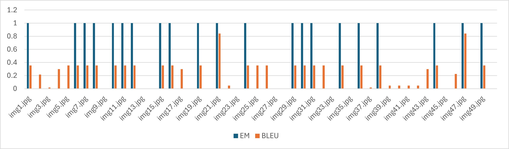

# Tiny VQA Evaluation Harness

This repository contains a **Tiny Visual Question Answering (VQA) evaluation harness** using 50 images and questions.

## Features
- PyTorch Dataset for loading images and questions
- Pretrained BLIP VQA model from HuggingFace
- Evaluation metrics: Exact Match (EM) and BLEU
- Detailed per-sample results saved to CSV

## Dataset
- 50 images in `data/images/`
- Corresponding Q/A in `data/questions.json`

## Usage

1. **Clone the repository:**

   ```sh
   git clone https://github.com/meehirmhatrepy/Tiny-VQA-Eval.git
   cd Tiny-VQA-Eval
   ```

2. **Install dependencies:**

   ```sh
   pip install -r requirements.txt
   ```

3. **Run evaluation:**

   ```sh
   python eval.py
   ```

---
## 🎨 Screenshots

*Results:*  
  